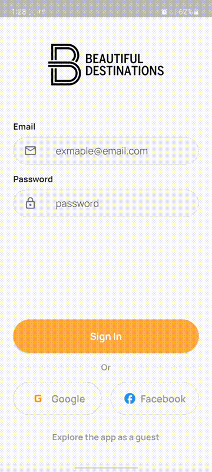
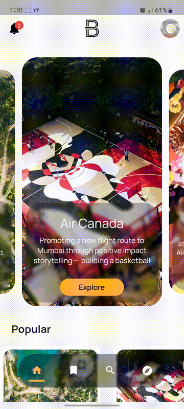
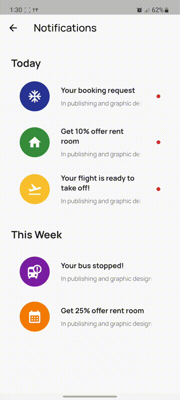
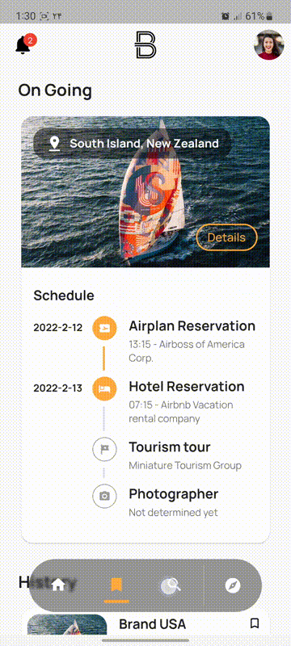
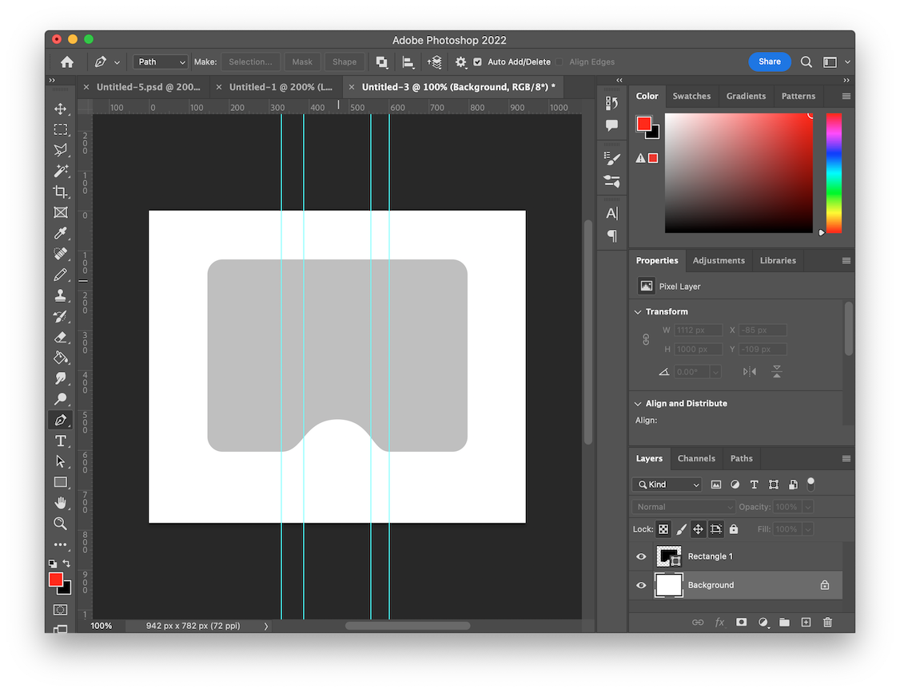

# Beautiful Destinations MockUp App

## Disclaimer
This Repository And The Codes Published In It, Are My OWN Personal Project, And Has NOTHING to do with the Beautiful Destinations Company. 

## Company

Beautiful Destinations is a multi-award-winning strategic, creative, and content studio with one of the world’s largest & most influential online travel communities.

## Preview
All videos, logos, and textual information are gathered from the official company's website. Videos are center-cropped and reduced its size to 500x500, the sound quality is reduced to 100k, and `libx265` video encoding with 250k bitrate is used. All these actions were done to achieve a better app size.

| | |
|---|---|
| Landing Page | Login |
|| |
|Home | Bookmark |
|| |
| Notification | Search |
|| |
| Video Feed | |
|| |

And here is how i made the landing page:

## Motivation
Why did I develop this app, and also why under the name of this company?

I believe one of the ultimate goals of software is to help humanity and make life enjoyable. Sometimes we can make the `need` and by satisfying it create the illusion of happiness. That's the core idea of this application and that's why I like it. 

The idea of this application is to show people the beauty of tourist destinations and encourage them to travel. The difference between this application with other applications is that we are not focused on the hotel and tourism income (at least in the first place) but on fulfilling the lack of happiness itself! of course, the main goal from all companies' perspectives is the tourism income by the way! No blame ...

## How to run ?

Due to the the limitation of the `video_player` library used in this projects, it's only avaliable in the Android and iOS operating system. To run this project, clone it and use the command bellow:

`flutter run --release`

and for building use

`flutter build apk --release --no-tree-shake-icons`

You can also download the released apk app at
https://github.com/MohammadJamali/beautiful-destinations-mockup/releases/

## TODO

* Leverage the benefits of `dart_vlc` library to add windows and linux support
* Use a video player library for macOS support
* Integrate with bloc library
* Fetch information from a mockup server
* Spliting widgets to smaller widgets
* Add Booking Page View
* Add Payment Page View
* Add Settings Page View

## Hashtags

#flutter #dart #android #iOS #mockup
